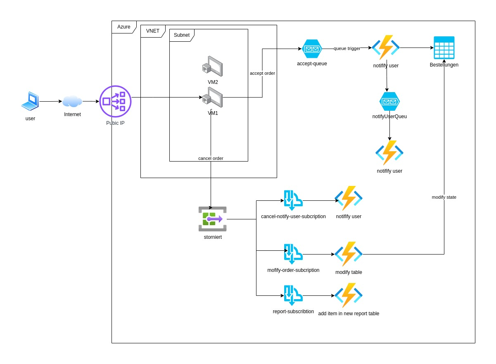

# Aufgabe: Erstellung eines VNet mit LoadBalancer und VMs für eine Spring-Anwendung

## Ziel

Erstellen Sie ein virtuelles Netzwerk (VNet) in Azure, das einen LoadBalancer und zwei virtuelle Maschinen in einem Subnetz umfasst. Auf den VMs soll eine Spring-Anwendung laufen, die spezifische Endpunkte für die Bestellverwaltung bereitstellt. Die Daten der Bestellungen sollen in einem Azure Storage Account Table gespeichert und entsprechende Benachrichtigungen sowie Zustandsänderungen über Azure Functions und Service Bus Topics gehandhabt werden.



## Anforderungen

1. **VNet und Subnetz:**

   - Erstellen Sie ein VNet in Azure mit einem Subnetz.
   - Stellen Sie sicher, dass das Subnetz für die beiden VMs und den LoadBalancer geeignet konfiguriert ist.

2. **LoadBalancer:**

   - Richten Sie einen Azure LoadBalancer ein, der Anfragen an die beiden VMs verteilt.

3. **Virtuelle Maschinen:**

   - Erstellen Sie zwei VMs (Ubuntu 20 LTS) innerhalb des VNets im erstellten Subnetz.
   - Damit die VM zugriff auf das Internet hat, muss in Loadbalancer ein outbound rule erstellt werden
     
   - **Java-Installation:** Installieren Sie Java auf beiden VMs, da dies für die Ausführung der Spring-Anwendung erforderlich ist. Siehe https://www.rosehosting.com/blog/how-to-install-java-17-lts-on-ubuntu-20-04/
   - **Anwendungsbereitstellung:** Kopieren Sie die ausführbare `.jar`-Datei der Spring-Anwendung mithilfe von `scp` (Secure Copy) auf jede VM. Verwenden Sie `ssh` (Secure Shell), um sich bei den VMs anzumelden und die Anwendung zu starten. ggf. funktioniert ssh/scp nicht aus dem internen Netz, dann über den Mobilen Hotspot versuchen. Weitere informationen https://linuxize.com/post/how-to-use-scp-command-to-securely-transfer-files/
   - Konfigurieren Sie eine Spring-Anwendung auf beiden VMs, die folgende Endpunkte bereitstellt:
     - `POST /order` - Nimmt eine neue Bestellung entgegen.
     - `PUT /order/{id}` - Ändert den Zustand einer Bestellung (`akzeptiert`, `in Verarbeitung`, `in Auslieferung`, `storniert`).

4. **Azure Storage Account Table:**

   - Erstellen Sie einen Azure Storage Account und innerhalb dessen eine Table, um die Bestelldaten zu speichern.

     https://learn.microsoft.com/de-de/azure/cosmos-db/table/how-to-use-java#add-an-entity-to-a-table

     ```json
     {
      "name": string,
      "email": string
      "state": accepted, in_processing, in_delivery, canceled,
      "orderNo": string
     }
     ```

5. **Azure Function für E-Mail-Benachrichtigungen:**

   - Implementieren Sie eine Azure Function, die getriggert wird, sobald eine neue Bestellung in der Table gespeichert wird. Diese Funktion soll dann eine E-Mail an den Benutzer senden. Das versenden einer Email kann erstmal per consolen Ausgabe simmuliert werden und muss keine echte Email versendet werden.

6. **Azure Service Bus und Topics für stornierte Bestellungen:**

   - Erstellen Sie ein Topic im Azure Service Bus, in das eine Nachricht geschrieben wird, wenn eine Bestellung über die Spring-Anwendung storniert wird. (Tipp nutzen sie dafür die Filter Funktion)
   - Richten Sie drei Subscribers für das Topic ein:
     1. Ein Subscriber sendet eine Bestätigungsemail an den Benutzer.
     2. Ein Subscriber ändert den Zustand der Bestellung in der Azure Storage Account Table.
     3. Ein Subscriber schreibt den Zeitpunkt und Grund der Stornierung in eine separate Tabelle für spätere Auswertungen.

   https://github.com/Azure/azure-sdk-for-java/blob/main/sdk/servicebus/azure-messaging-servicebus/README.md

## Hinweise

- Verwenden Sie für die Entwicklung der Spring-Anwendung geeignete REST-Prinzipien und stellen Sie sicher, dass die Anwendung stateless ist, um eine optimale Skalierbarkeit und Verfügbarkeit im Cloud-Umfeld zu gewährleisten.
- Überlegen Sie, wie Sie die Idempotenz und Transaktionalität beim Schreiben in den Azure Storage Account und beim Senden von Nachrichten an den Service Bus sicherstellen können.
