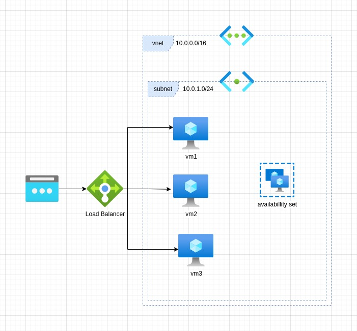
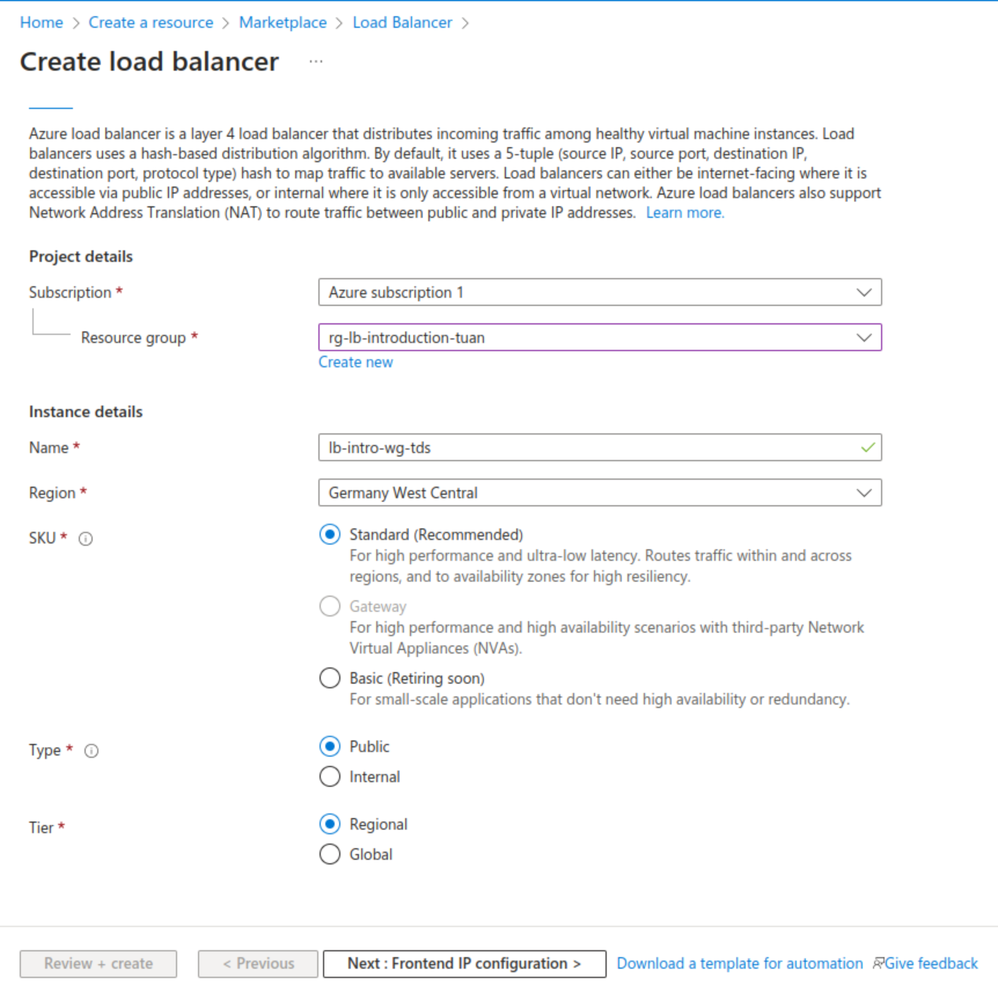
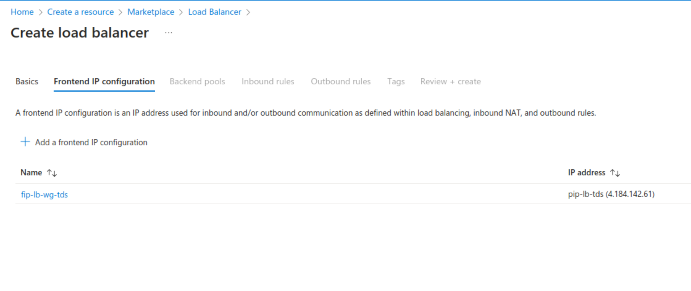
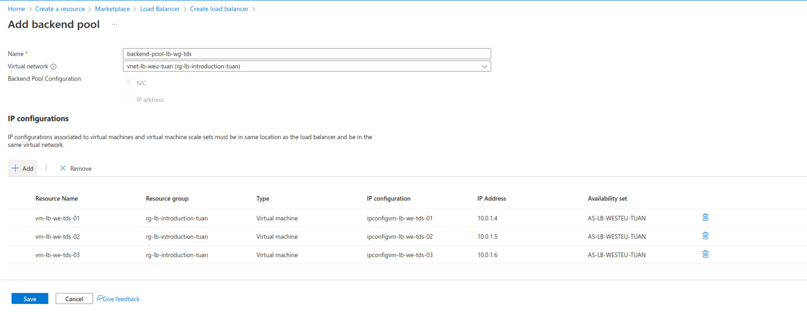
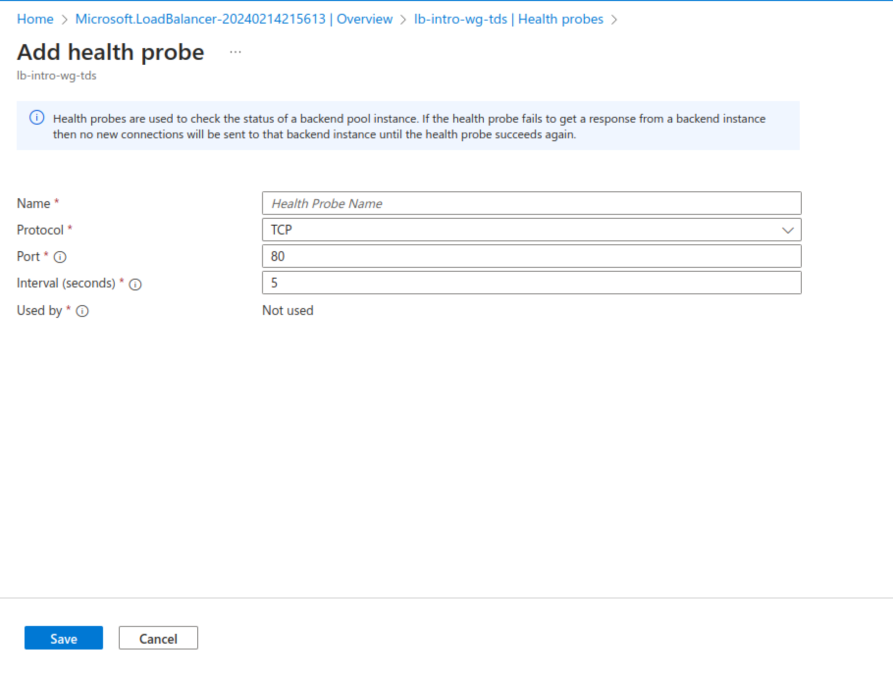
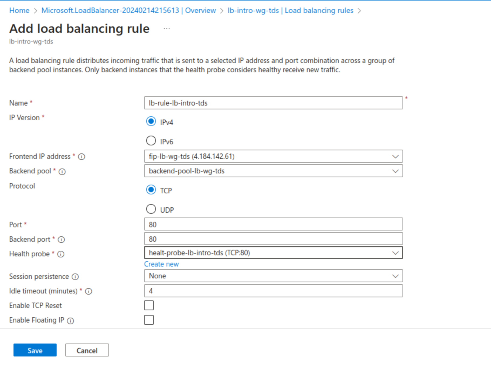

## Target picture

## Create the backends via script (Iac)

- start the azure cloud shell
- execute `touch create-env.sh` in the shell
- execute `nano create-env.sh` in the shell
- paste the content of the `create-env.sh` from the repo into to new file
- save with `Ctrl+O and Ctrl+X`
- set the permision `chmod +x create-env.sh`
- execute the script `./create-env.sh`

## Testing the vm

- go to one of the created vm, open `the Command` in the **navigation** then run **RunPowerShellScript** with the command `curl localhost -usebasicparsing` (be patient, may take up to 1-2 min)

## Load balancer

- go to the marketplace and search for **Load Balancer**

## Health probes

Health Probes are a feature in the management of load balanced environments, serving as mechanisms to ensure high availability and reliability of applications by continuously monitoring the health of backend servers. These probes are automated tests sent at regular intervals to the backend servers to check their status and responsiveness.

## Load balancing rule

A Load Balancing Rule is a key component in the configuration of load balancers, determining how incoming traffic is distributed across multiple backend servers. These rules specify, based on certain criteria such as port and protocol specifications, how incoming traffic is mapped to target resources.
Load Balancing Rules can include advanced settings like health probes, which ensure traffic is only forwarded to healthy, available servers, session persistence settings that allow for the session-based allocation of client requests to specific servers, and connection timeout configurations.

 
