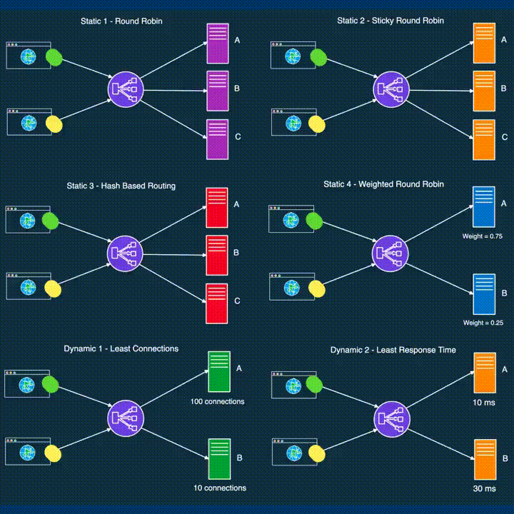

# Load Balancing Algorithms

https://medium.com/@Ian_carson/load-balancers-and-the-fundamental-algorithms-it-uses-44278f68fae0

# Static

- **Round Robin**

  - Anfragen werden sequenziell auf eine Gruppe von Servern verteilt.
  - Es bietet keine Garantie dafür, dass mehrere Anfragen von einem Benutzer die gleiche Instanz erreichen können.

- **Sticky Round Robin**

  - Eine bessere Alternative zum Round Robin Algorithmus.
  - Verschiedene Anfragen vom selben Benutzer gehen zur selben Instanz.

- **Hash-Based**

  - Verteilt Anfragen basierend auf dem Hash-Schlüsselwert.
  - Der Schlüssel kann die IP-Adresse oder die URL der Anfrage sein.
- **IP Hash**
  - Anfragen werden basierend auf der Hash-Wert der IP-Adresse des Clients auf die Server verteilt.
  - Gewährleistet, dass Anfragen desselben Benutzers an denselben Server weitergeleitet werden, was eine Session-Persistenz ermöglicht.
  - Besonders nützlich in Anwendungsfällen, bei denen die Beibehaltung der Benutzersitzung über mehrere Anfragen hinweg wichtig ist.

- **Weighted Round Robin**
  - Jeder Server erhält einen Gewichtungswert.
  - Der Wert bestimmt den Anteil des Traffics.
  - Server mit höherem Gewicht erhalten mehr Traffic.
  - Am besten für Setups geeignet, die Server mit unterschiedlichen Kapazitätsstufen haben.

# Dynamic

- **Least Connections**

  - Neue Anfragen werden an die Server mit der geringsten Anzahl an Verbindungen gesendet.
  - Die Anzahl der Verbindungen wird basierend auf der relativen Rechenkapazität eines Servers bestimmt.

- **Least Response Time**

  - Eine neue Anfrage wird an den Server mit der niedrigsten Antwortzeit gesendet, um die Gesamtantwortzeit zu minimieren.
  - Gut geeignet für Fälle, in denen die Antwortzeit kritisch ist.

